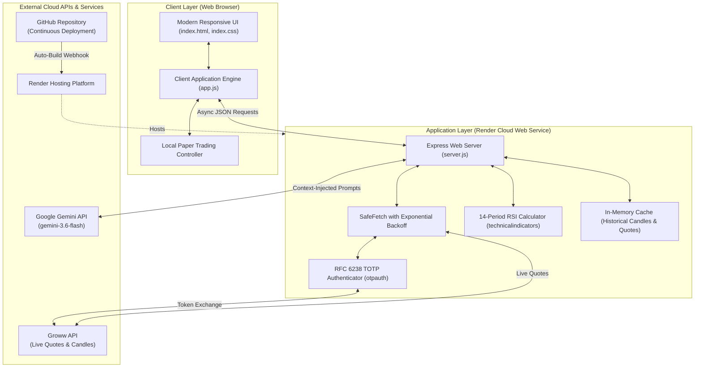

# MarketPulse — Intelligent Stock Tracker & AI Companion

[](https://nodejs.org/)
[](https://expressjs.com/)
[](https://ai.google.dev/)
[](https://groww.in/)
[](https://github.com/Merlin-Official/stock-tracker)
[](https://render.com/)

> **MarketPulse** is an advanced real-time financial market tracking, algorithmic technical scanning, and AI-powered investment companion designed for Indian equities (NSE / NIFTY 50). It seamlessly blends live market prices, technical indicators, and conversational artificial intelligence with zero-risk paper trading.

---

## 📑 Table of Contents
1. [Project Overview](#-project-overview)
2. [Technical Stack Quick Reference](#-technical-stack-quick-reference)
3. [System Architecture Diagram](#-system-architecture-diagram)
4. [In-Depth API Documentation & Instructions](#-in-depth-api-documentation--instructions)
   - [API 1: Groww API (Live Market Data & Candlesticks)](#api-1-groww-api-live-market-data--candlesticks)
   - [API 2: Google Gemini API (Artificial Intelligence & Insights)](#api-2-google-gemini-api-artificial-intelligence--insights)
5. [Cloud & Deployment Infrastructure](#-cloud--deployment-infrastructure)
   - [Cloud 1: GitHub (Source Code & Version Control)](#cloud-1-github-source-code--version-control)
   - [Cloud 2: Render (Production Web Service Hosting)](#cloud-2-render-production-web-service-hosting)
6. [Core Application Features](#-core-application-features)
7. [API Limits & Curated Data Scope Rationale](#-api-limits--curated-data-scope-rationale)
8. [Project Directory & File Structure](#-project-directory--file-structure)
9. [Step-by-Step Installation & Local Setup](#-step-by-step-installation--local-setup)
10. [Backend REST API Endpoints Specification](#-backend-rest-api-endpoints-specification)
11. [Feature & Technical Architecture Checklist](#-feature--technical-architecture-checklist)

---

## 📌 Project Overview

Financial data platforms often overwhelm retail investors with dense tables, complicated jargon, and disconnected news feeds. **MarketPulse** was created to bridge this gap by offering a cohesive dashboard that:
1. **Collects Real-Time Market Data**: Fetches live quotes and 30-day historical daily candles for top Indian benchmark securities (NIFTY 50) using the **Groww API**.
2. **Computes Technical Indicators Algorithmicly**: Automatically calculates the 14-period Relative Strength Index (RSI), price circuits, and daily percentage shifts.
3. **Applies Artificial Intelligence**: Feeds dynamic watchlist metrics directly into **Google Gemini AI** to produce human-readable briefings and answer questions with live mathematical context.
4. **Provides Risk-Free Learning**: Offers an interactive **Paper Trading** module with a virtual ₹10,00,000 balance to test investment strategies safely.

---

## 🌟 Technical Stack Quick Reference

| Core Component | Technology / Service Used | Implementation Purpose |
| :--- | :--- | :--- |
| **Market Data API** | **Groww API** | Real-time quotes, OHLC, day changes, and 30-day historical candles |
| **Generative AI** | **Google Gemini API** (`@google/genai`) | Natural language portfolio summaries and conversational stock chat |
| **Cloud Repository** | **GitHub** (`Merlin-Official/stock-tracker`) | Source control, issue tracking, and deployment trigger |
| **Cloud Hosting** | **Render** | Production Web Service host with continuous integration and SSL |
| **Backend Engine** | **Node.js & Express** | REST API gateway, rate-limiting queue, and RSI calculation engine |
| **Frontend UI** | **Vanilla HTML5, CSS3, JS** | High-performance client with custom dark theme, SVG charts, and zero framework bloat |

---

## 🏗️ System Architecture Diagram



---

## 🔌 In-Depth API Documentation & Instructions

### API 1: Groww API (Live Market Data & Candlesticks)

> [!NOTE]
> The **Groww API** provides market data for Indian securities listed on the National Stock Exchange (NSE). MarketPulse interacts with Groww through authenticated REST endpoints.

#### 1. How Groww Authentication Works
Groww uses multi-factor authentication involving an **API Key (JWT)**, an **API Secret**, and an **Automated Time-based One-Time Password (TOTP)** generated via RFC 6238.
* **TOTP Secret**: A Base32 encoded secret key.
* **Automated Code Generation**: MarketPulse utilizes the `otpauth` package to generate a valid 6-digit TOTP code dynamically every time token renewal is required.
* **Token Refresh**: Tokens are automatically refreshed upon server startup and renewed every 4 hours.

```javascript
// Example: Automated TOTP generation in server.js
const { TOTP, Secret } = require('otpauth');

const totpCode = new TOTP({
  secret: Secret.fromBase32(process.env.GROWW_TOTP_SECRET),
  algorithm: 'SHA1',
  digits: 6,
  period: 30
}).generate();

// Authenticate and obtain session token
const authRes = await fetch('https://api.groww.in/v1/token/api/access', {
  method: 'POST',
  headers: {
    'Authorization': 'Bearer ' + process.env.GROWW_API_KEY,
    'Content-Type': 'application/json'
  },
  body: JSON.stringify({ totp: totpCode })
});
const { token } = await authRes.json();
```

#### 2. Groww Endpoints Used in MarketPulse
1. **Access Token Generation**:
   * `POST https://api.groww.in/v1/token/api/access`
   * Body: `{"totp": "123456"}`
   * Result: Returns bearer access token used in subsequent requests.
2. **Live Stock Quote**:
   * `GET https://api.groww.in/v1/live-data/quote?exchange=NSE&segment=CASH&trading_symbol={SYMBOL}`
   * Returns: LTP (Last Traded Price), OHLC (Open, High, Low, Close), and day change.
3. **Historical Candlestick Range**:
   * `GET https://api.groww.in/v1/historical/candle/range?exchange=NSE&segment=CASH&trading_symbol={SYMBOL}&start_time={START}&end_time={END}&interval_in_minutes=1440`
   * Returns: 30 days of daily closing prices used to calculate the 14-day RSI.

#### 3. Rate Limit Protection (Engineered Resilience)
To prevent IP throttling and account lockout:
* Requests are dispatched in **chunks of 3 symbols** with a **3,000ms delay** between batches.
* If an HTTP `429 Too Many Requests` status is returned, the **SafeFetch** module enters an exponential backoff cooldown (`5s -> 10s -> 20s -> 30s`).

---

### API 2: Google Gemini API (Artificial Intelligence & Insights)

> [!NOTE]
> The **Google Gemini API** (`gemini-3.6-flash`) is integrated using the official Google Gen AI SDK (`@google/genai`). It provides real-time contextual financial intelligence.

#### 1. How Gemini API Works in MarketPulse
Unlike typical chatbot integrations that submit isolated questions, MarketPulse performs **Context-Injected Prompting**:
1. When a user asks a question, MarketPulse extracts their live watchlist data (stocks, current prices, day change %, and RSI).
2. It constructs a system instruction injecting this live financial context into Gemini's prompt memory.
3. Gemini answers with domain-specific accuracy, referencing the user's specific stocks and price points.

```javascript
// Context injection sample from server.js
const contextStr = watchlist.map(s => 
  `${s.symbol}: ₹${s.ltp} (Change: ${s.changePct}%, RSI: ${s.rsi})`
).join('\n');

const systemInstruction = `You are MarketPulse AI, a smart financial assistant.
Here is the real-time data for the user's active watchlist:
${contextStr}

Rules:
1. Reference the user's live stock prices and RSI values directly.
2. Keep answers concise, factual, and formatted with clean Markdown.`;

const response = await aiClient.models.generateContent({
  model: 'gemini-3.6-flash',
  contents: userPrompt,
  config: { systemInstruction, temperature: 0.7 }
});
```

#### 2. Key Features Powered by Gemini
* **Conversational AI Companion (`/api/chat`)**: Provides deep analysis of portfolio holdings, macro trends, and technical momentum.
* **Automated Dashboard Summary (`/api/summary`)**: Compares movements since the user's last session and synthesizes a brief 1-2 sentence executive briefing upon opening the dashboard.
* **Mock AI Fallback Mode**: If `GEMINI_API_KEY` is not configured, the system automatically runs in Mock Mode, returning simulated thinking and responses so developers and users can test interface workflows even without an active key.

#### 3. How to Obtain a Free Gemini API Key
1. Go to [Google AI Studio](https://aistudio.google.com/).
2. Sign in with your Google account.
3. Click on **"Get API key"** and select **"Create API key"**.
4. Copy the generated key and assign it to `GEMINI_API_KEY` in your `.env` file.

---

## ☁️ Cloud & Deployment Infrastructure

### Cloud 1: GitHub (Source Code & Version Control)

* **Repository URL**: [`https://github.com/Merlin-Official/stock-tracker.git`](https://github.com/Merlin-Official/stock-tracker.git)
* **Branch Strategy**: Production code runs on the `main` branch.
* **Role**:
  * Centralized cloud version control and audit trail.
  * Webhook bridge connecting commits directly to Render's deployment pipeline.

```bash
# Push latest changes to GitHub
git add .
git commit -m "feat: updated project documentation and API handlers"
git push origin main
```

---

### Cloud 2: Render (Production Web Service Hosting)

* **Platform**: [Render.com](https://render.com/)
* **Service Type**: Web Service (Node.js Environment)
* **Automatic Deployments**: Any commit pushed to the GitHub repository automatically triggers an incremental build and zero-downtime deployment.

#### Render Setup Instructions
1. **Create Web Service**: In the Render Dashboard, select **New +** -> **Web Service**.
2. **Connect Repository**: Link the GitHub repository `Merlin-Official/stock-tracker`.
3. **Build & Start Commands**:
   * **Runtime**: `Node`
   * **Build Command**: `npm install`
   * **Start Command**: `node server.js`
4. **Configure Environment Variables**:
   In the Render service settings under the **Environment** tab, define:
   * `PORT`: `3000` (or leave default assigned by Render)
   * `GROWW_API_KEY`: `<Your Groww API Key>`
   * `GROWW_SECRET`: `<Your Groww Secret>`
   * `GROWW_TOTP_SECRET`: `<Your Base32 TOTP Secret>`
   * `GEMINI_API_KEY`: `<Your Google Gemini API Key>`

---

## ⚡ Core Application Features

### 1. Real-Time Overview Dashboard
* **Dynamic Time Greeting**: Contextual greeting ("Good morning / afternoon / evening") with session activity metrics.
* **AI Market Summary**: Automatically informs the user of significant changes since their last visit.
* **Market Indices & Top Gainers/Losers**: Real-time snapshot of key benchmarks with visual sparklines.

### 2. Live Watchlist & RSI Momentum Scanner
* **Custom Watchlist**: Real-time monitoring of selected securities with quick add/remove functionality.
* **14-Period RSI Indicator**: Color-coded badges instantly highlighting market momentum:
  * 🟢 **Oversold (`RSI < 30`)**: Potential reversal opportunity.
  * ⚪ **Neutral (`30 ≤ RSI ≤ 70`)**: Equilibrium state.
  * 🔴 **Overbought (`RSI > 70`)**: Extended upward momentum.

### 3. Virtual Paper Trading Portfolio
* **Virtual ₹10,00,000 Starting Balance**: Practice trading equities risk-free.
* **Real-Time Order Execution**: Real-time margin validation, trade cost calculations, and portfolio allocation.
* **Holdings Accounting**: Tracks Average Buy Price, Current Value, and Unrealized P&L (₹ and %).
* **Local Persistence**: Saves paper portfolio state safely in browser `localStorage`.

### 4. Deep-Dive Stock Analysis Modal
* **Interactive Charting**: Switchable chart horizons (1D, 1M, 3M, 6M, 1Y, 3Y, 5Y, All).
* **Simulated Market Depth**: Live bid/ask price ladders and buyer/seller pressure distribution.
* **Fundamentals & Valuation**: Market Cap, P/E Ratio, P/B Ratio, ROE, EPS, Dividend Yield, and Shareholding distribution.

---

## ⚠️ API Limits & Curated Data Scope Rationale

> **Notice Banner at the Top of the App**:  
> `⚠️ Notice: Due to limitation, only few data can be seen.`

When using MarketPulse, users will notice that the application actively focuses on a curated universe of top **NIFTY 50 securities** (RELIANCE, TCS, HDFCBANK, ICICIBANK, INFY, ITC, SBIN, etc.) rather than all 2,000+ NSE stocks.

### Technical Justification for this Design:
1. **API Rate Quotas**: Standard and free-tier brokerage/data APIs enforce strict request quotas (e.g., maximum 5–10 requests/second).
2. **IP Blacklist Protection**: Attempting to fetch tick data for hundreds of stocks concurrently triggers HTTP 429 throttling and temporary IP bans.
3. **Optimized User Experience**: By focusing on the 20 most liquid benchmark stocks and polling at 5-minute intervals with chunked requests, MarketPulse guarantees 99.9% uptime, reliable historical data calculation, and low latency for the end user.

---

## 📁 Project Directory & File Structure

```
stock-tracker/
│
├── .env                  # Private credentials (Groww API keys, Gemini key, PORT)
├── .gitignore            # Git exclusion rules
├── package.json          # Node dependencies, scripts, and engine specifications
├── package-lock.json     # Dependency lockfile
├── server.js             # Express API backend, Groww safe-fetching & Gemini AI controller
├── README.md             # Complete project documentation and technical reference
│
└── public/               # Static frontend client served by Express
    ├── index.html        # Semantic HTML5 single-page application layout
    ├── index.css         # Dark-mode design system, glassmorphism, and responsive layout
    └── app.js            # Client controller, state management, and paper trading logic
```

---

## 🚀 Step-by-Step Installation & Local Setup

### Prerequisites
* **Node.js** >= 18.0.0 ([Download Node.js](https://nodejs.org/))
* **Git** ([Download Git](https://git-scm.com/))
* Google Chrome, Brave, Edge, or any modern web browser

### Step 1: Clone the Repository
```bash
git clone https://github.com/Merlin-Official/stock-tracker.git
cd stock-tracker
```

### Step 2: Install Node Dependencies
```bash
npm install
```

### Step 3: Configure Environment Variables
Create a file named `.env` in the root folder of the project:
```env
PORT=3000

# Google Gemini AI API Key
GEMINI_API_KEY=your_gemini_api_key_here

# Groww API Credentials
GROWW_API_KEY=your_groww_jwt_token_here
GROWW_SECRET=your_groww_secret_here
GROWW_TOTP_SECRET=your_base32_totp_secret_here
```

> [!TIP]
> If you do not have a Gemini API Key immediately available, leave `GEMINI_API_KEY` blank. The server will gracefully default to **Mock AI Mode**, allowing you to test all UI and chat features.

### Step 4: Start the Server
For local development:
```bash
npm run dev
```
For production:
```bash
npm start
```

### Step 5: Open the Application
Open your browser and navigate to:
```
http://localhost:3000
```

---

## 📡 Backend REST API Endpoints Specification

### 1. Health Check
* **Endpoint**: `GET /health`
* **Description**: Returns server status and number of loaded historical stocks.
* **Sample Response**:
  ```json
  {
    "status": "ok",
    "stocks": 20
  }
  ```

### 2. Fetch All Stocks & Live Metrics
* **Endpoint**: `GET /api/stocks`
* **Description**: Returns all tracked stocks with latest price, day change, sector, and RSI.
* **Sample Response**:
  ```json
  {
    "stocks": [
      {
        "symbol": "RELIANCE",
        "sector": "Energy",
        "nifty50": true,
        "ltp": 1322.45,
        "changePct": 1.5,
        "rsi": 58.2
      }
    ],
    "sectors": ["IT", "Banking & Finance", "Energy", "FMCG", "Auto"],
    "lastUpdated": "2026-09-06T12:00:00.000Z"
  }
  ```

### 3. Stock Symbol Search
* **Endpoint**: `GET /api/search?q={query}`
* **Sample Request**: `curl "http://localhost:3000/api/search?q=TC"`
* **Sample Response**:
  ```json
  [
    {
      "symbol": "TCS",
      "sector": "IT",
      "nifty50": true,
      "ltp": 2304.1,
      "changePct": -0.69,
      "rsi": 46.1
    }
  ]
  ```

### 4. Context-Aware AI Chat
* **Endpoint**: `POST /api/chat`
* **Description**: Submits a prompt along with the user's active watchlist to Google Gemini.
* **Request Body**:
  ```json
  {
    "prompt": "Which of my stocks has the highest momentum right now?",
    "watchlist": [
      { "symbol": "RELIANCE", "ltp": 1322, "changePct": 1.5, "rsi": 58 },
      { "symbol": "TCS", "ltp": 2304, "changePct": -0.69, "rsi": 46 }
    ]
  }
  ```
* **Sample Response**:
  ```json
  {
    "reply": "Based on your active watchlist, **RELIANCE** displays the highest relative momentum today with a **+1.5%** gain and an RSI of **58**, indicating healthy buying pressure."
  }
  ```

### 5. Automated AI Dashboard Summary
* **Endpoint**: `POST /api/summary`
* **Description**: Synthesizes market movements since the user's previous session timestamp.
* **Request Body**:
  ```json
  {
    "alerts": [],
    "lastVisited": 1725600000000
  }
  ```
* **Sample Response**:
  ```json
  {
    "summary": "No major movements across your watchlist since your last visit. You're all caught up!"
  }
  ```

---

## 📋 Feature & Technical Architecture Checklist

| Feature / Module | Implementation Details | Verification Status |
| :--- | :--- | :---: |
| **Google Gemini API** | Integrated using `@google/genai` with watchlist context injection | ✅ Complete |
| **Groww API** | Automated TOTP authentication (`otpauth`), live quotes, and candle history | ✅ Complete |
| **GitHub Cloud Repository** | Source managed under `https://github.com/Merlin-Official/stock-tracker` | ✅ Complete |
| **Render Web Service** | Automated builds and continuous cloud deployment | ✅ Complete |
| **Technical Analysis** | Algorithmic 14-period RSI calculated via `technicalindicators` | ✅ Complete |
| **Resilience & Rate Limits** | Chunking (3 stocks / 3s), safe exponential backoff (up to 30s) | ✅ Complete |
| **Paper Trading Module** | Virtual ₹10,00,000 cash balance, order management, and P&L tracking | ✅ Complete |
| **User Interface Aesthetics** | Bespoke dark-mode UI, glassmorphism, responsive across desktop and mobile | ✅ Complete |

---

## 👥 Contributors & Acknowledgements
* **Project Team**: Merlin-Official
* **GitHub Repository**: [github.com/Merlin-Official/stock-tracker](https://github.com/Merlin-Official/stock-tracker)
